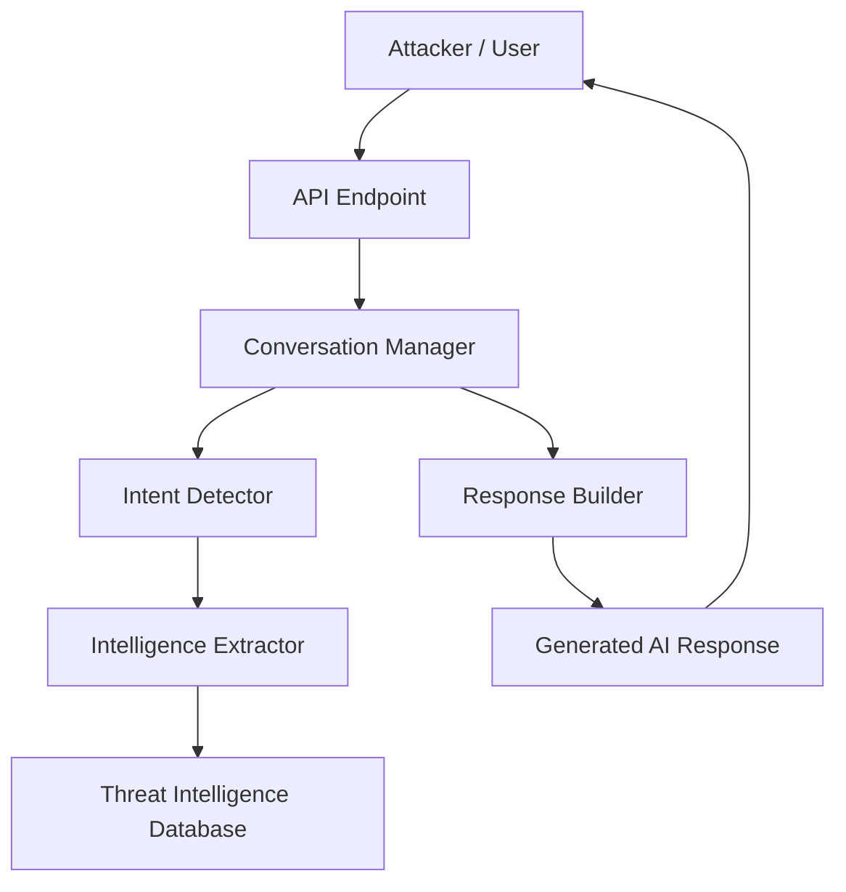

# System Architecture

## Explanation

1. **API Endpoint** receives attacker interaction.
2. **Conversation Manager** tracks conversation state.
3. **Intent Detector** identifies attacker goals.
4. **Intelligence Extractor** gathers threat data.
5. **Response Builder** generates the honeypot reply.
